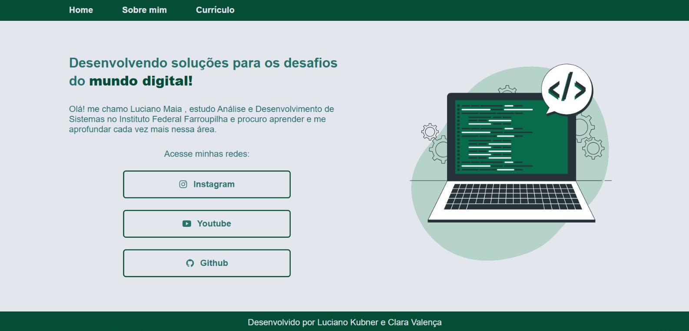
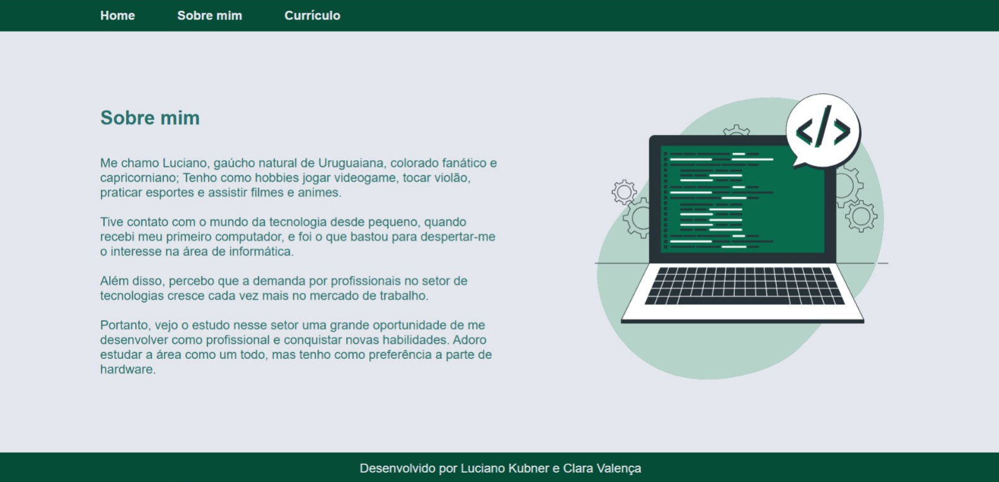
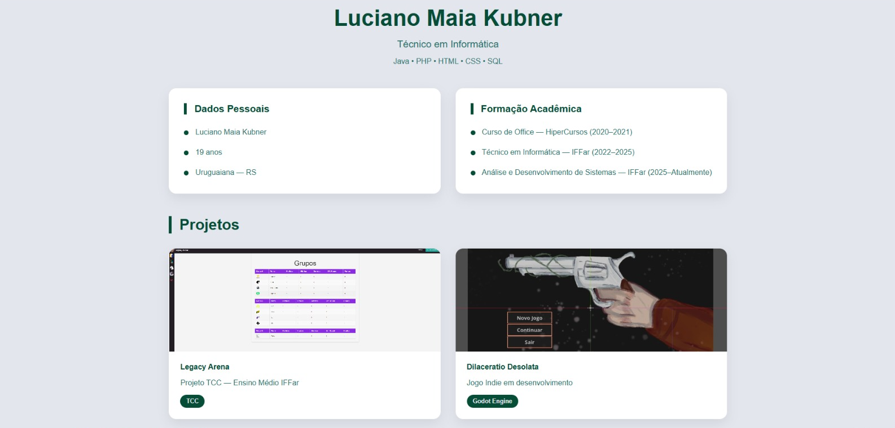

# Portfólio Web – Oficina de HTML e CSS

Este projeto consiste em um portfólio pessoal desenvolvido com **HTML5** e **CSS3**, criado como material de apoio para a **Oficina de HTML e CSS** realizada durante a **Semana Acadêmica do Instituto Federal Farroupilha (IFFar)**.

O objetivo da oficina é apresentar os conceitos fundamentais de desenvolvimento web para estudantes, demonstrando na prática a construção de um site estático utilizando boas práticas de estruturação e estilização.

## 📄 Páginas do Projeto

O portfólio é composto por três páginas principais:

### 🏠 Home
Página inicial contendo uma breve apresentação do desenvolvedor e links para redes sociais.

### 👤 Sobre Mim
Página destinada à apresentação pessoal, trajetória acadêmica e interesses na área de tecnologia.

### 📋 Currículo
Página contendo informações acadêmicas, formação, habilidades e projetos desenvolvidos.

---

## 🚀 Publicação

O projeto será publicado utilizando a plataforma **Vercel**, permitindo acesso público e gratuito ao portfólio.

🔗 Hospedagem: https://vercel.com/

---

## 🛠️ Tecnologias Utilizadas

- HTML5
- CSS3
- Flexbox
- CSS Grid
- Responsividade

---

## 📚 Material de Apoio

Os seguintes recursos foram utilizados durante o desenvolvimento e na preparação da oficina:

- [W3Schools](https://www.w3schools.com/)
- [Ionicons](https://ionic.io/ionicons) (ícones)
- [Storyset](https://storyset.com/business) (ilustrações SVG)
- [MDN Web Docs](https://developer.mozilla.org/pt-BR/) (documentação e referências)
- [Vercel](https://vercel.com/) (hospedagem)

---

## 🎨 Créditos dos Recursos Visuais

### Ícones

Os ícones utilizados no projeto foram obtidos através da biblioteca:

🔗 https://ionic.io/ionicons

### Ilustração SVG

A ilustração SVG utilizada no projeto foi baseada em recursos disponíveis através da documentação da Mozilla e da plataforma Storyset:

🔗 https://developer.mozilla.org/pt-BR/

🔗 https://storyset.com/business

---

## 📑 Slides da Oficina

Os slides utilizados durante a oficina podem ser acessados através do link abaixo:

🔗 https://canva.link/bhxf8m9rp0keacp

---

## 👨‍💻 Autores

### Luciano Maia Kubner

GitHub:
https://github.com/kubnerr

### Clara Valença

GitHub:
https://github.com/Clara0223Valenca?tab=repositories

---

## 🎯 Objetivo Educacional

Este projeto foi desenvolvido com fins educacionais para demonstrar conceitos como:

- Estruturação semântica com HTML5;
- Estilização utilizando CSS3;
- Organização de layouts com Flexbox;
- Criação de grids responsivos;
- Utilização de variáveis CSS;
- Boas práticas de organização de código;
- Publicação de aplicações estáticas na Vercel.

## 📷 Demonstração

### Home

### Sobre Mim

### Currículo

---

Instituto Federal Farroupilha Uruguaiana– Semana Acadêmica
